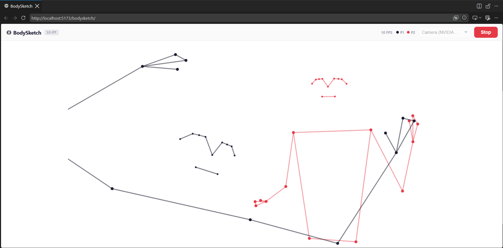

# ◎ BodySketch

**Real-time 33-point body skeleton tracker — runs entirely in your browser. No server. No data collection. Just you and your stick figure.**

[](https://vjpatz.github.io/bodysketch/)
[](./LICENSE)
[](https://youtube.com/YOUR_VIDEO_LINK)



---

## What it does

Open the page → press **Start** → see your skeleton rendered in real time.

- 33 MediaPipe pose landmarks tracked per person
- Up to 4 people simultaneously, each with a distinct color
- One Euro filter smoothing — no jitter
- Mirror-mode canvas (feels like looking at yourself)
- Works on desktop and mobile

---

## Privacy

**Your camera feed never leaves your device.**

- Zero server calls during tracking
- No video is recorded, stored, or transmitted
- The MediaPipe model runs entirely via WebAssembly in your browser
- No analytics, no cookies, no accounts

You can verify this by opening DevTools → Network tab → camera data never appears in any request.

---

## Tech stack

| Layer | Technology |
|---|---|
| Pose detection | [MediaPipe Pose Landmarker](https://ai.google.dev/edge/mediapipe/solutions/vision/pose_landmarker) (WASM, in-browser) |
| Framework | React 18 |
| Build tool | Vite |
| Smoothing | One Euro Filter |
| Deploy | GitHub Pages via GitHub Actions |

---

## Run locally

```bash
git clone https://github.com/VJPatz/bodysketch.git
cd bodysketch
npm install
npm run dev
```

Open [http://localhost:5173/bodysketch/](http://localhost:5173/bodysketch/)

Requires a modern browser with camera access (Chrome or Edge recommended for best WebAssembly performance).

---

## Deploy to GitHub Pages

### Option 1 — GitHub Actions (recommended)

1. Fork or push this repo to GitHub
2. Go to **Settings → Pages → Source** → select **GitHub Actions**
3. Push to `main` — deploys automatically

### Option 2 — Manual

```bash
npm run deploy
```

Builds and pushes to the `gh-pages` branch. Set Pages source to **Deploy from a branch → gh-pages**.

> **Using a different repo name?**  
> Update `base` in `vite.config.js` to match: `base: '/<your-repo-name>/'`

---

## How it works

```
Camera feed (video element)
    ↓
MediaPipe Pose Landmarker (WASM, GPU delegate)
    ↓  33 landmarks × N people
PersonTracker  →  stable ID assignment across frames
    ↓
LandmarkSmoother  →  One Euro filter per landmark axis
    ↓
Canvas Renderer  →  bones + joints on white background
```

**Key files:**

| File | Role |
|---|---|
| `src/hooks/usePoseLandmarker.js` | Loads MediaPipe model, runs per-frame inference |
| `src/lib/tracker.js` | Greedy nearest-neighbor matching for stable person IDs |
| `src/lib/smoother.js` | One Euro filter — adaptive low-pass, smooth when slow / responsive when fast |
| `src/lib/renderer.js` | Canvas drawing: 33-point skeleton with configurable colors |
| `src/lib/constants.js` | Pose connections, person colors, render + tracker config |

---

## Configuration

All tunable values live in `src/lib/constants.js`:

```js
TRACKER_CONFIG = {
  maxPersons: 4,            // max simultaneous people
  maxDistance: 0.35,        // ID matching threshold (0–1 normalized)
  maxMissedFrames: 20,      // frames before a track is dropped
  minVisibleLandmarks: 8,   // quality gate
  minTorsoVisible: 2,       // requires core body structure
}

SMOOTHING_CONFIG = {
  minCutoff: 1.0,           // lower = smoother (more lag)
  beta: 0.007,              // higher = faster response to movement
}
```

---

## Browser support

| Browser | Status |
|---|---|
| Chrome / Edge (desktop) | ✅ Full support |
| Chrome (Android) | ✅ Full support |
| Safari (iOS 16+) | ✅ Works |
| Firefox | ⚠️ Works, slower (no GPU delegate) |

---

## License

MIT — see [LICENSE](./LICENSE)

Use it, fork it, build on it. Attribution appreciated.

---

## Contributing

PRs welcome. Keep it focused — this is intentionally a minimal, readable project.

1. Fork → branch → PR
2. No new dependencies without a good reason
3. Keep code readable (YouTube audience reads this)

---

*Built with MediaPipe + React + Vite*
